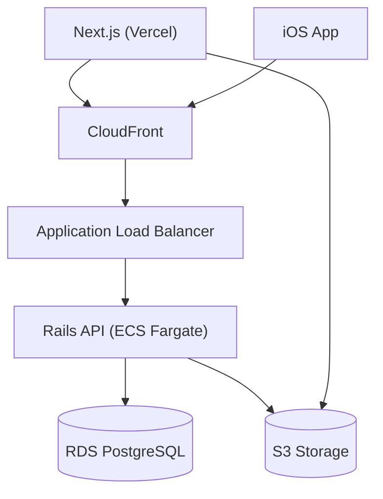

# Shuriken Note

## Overview
**Shuriken Note** is a personal note system designed around my own needs, stripping away unnecessary features from modern note-taking tools to stay simple, fast, and distraction-free.

The application is used and improved continuously in daily practice,
and major technical decisions are documented as ADRs (Architecture Decision Records).

---

## Product Vision

The product philosophy and design intent of Shuriken Note are documented here:

- [Product Vision](https://github.com/nyshk97/shuriken-note/blob/main/docs/product/vision.md)

---

## Try Demo

*Public demo environment will be available soon.*

---

## Key Features

*This section will be updated as implementation progresses.*

---

## Architecture



* Web frontend: Next.js on Vercel
* Backend API: Ruby on Rails on ECS Fargate
* Database: PostgreSQL on RDS
* File Storage: S3 (Active Storage Direct Upload)
* CDN / TLS: CloudFront + ACM
* Infrastructure as Code: Terraform

Infrastructure design details are documented in:
[ADR 0006: Infrastructure and Deployment](https://github.com/nyshk97/shuriken-note/blob/main/docs/adr/0006-infrastructure-deployment.md)

---

## Technology Stack

| Layer                  | Technology                  |
| ---------------------- | --------------------------- |
| Web Frontend           | Next.js (Vercel)            |
| Backend API            | Ruby on Rails (API-only)    |
| Database               | PostgreSQL (AWS RDS)        |
| Search                 | PostgreSQL Full Text Search |
| File Storage           | AWS S3 (Active Storage)     |
| CDN / TLS / DNS        | CloudFront + ACM + Route53  |
| Infrastructure as Code | Terraform                   |
| Error Tracking         | Sentry                      |
| Logging                | CloudWatch Logs             |

---

## Repository Structure

This project uses a monorepo layout.

* Rails API: `apps/api`
* Next.js Web: `apps/web`
* iOS (SwiftUI): `apps/ios`

---

## Design Decisions (ADR)

Major architectural decisions are recorded as ADRs.

* [ADR 0001: REST + OpenAPI](https://github.com/nyshk97/shuriken-note/blob/main/docs/adr/0001-rest-openapi.md)
* [ADR 0002: PostgreSQL Full Text Search](https://github.com/nyshk97/shuriken-note/blob/main/docs/adr/0002-postgresql-full-text-search.md)
* [ADR 0003: Active Storage Direct Upload](https://github.com/nyshk97/shuriken-note/blob/main/docs/adr/0003-active-storage-direct-upload.md)
* [ADR 0004: Authentication Strategy](https://github.com/nyshk97/shuriken-note/blob/main/docs/adr/0004-authentication-strategy.md)
* [ADR 0005: Authorization Strategy](https://github.com/nyshk97/shuriken-note/blob/main/docs/adr/0005-authorization-strategy.md)
* [ADR 0006: Infrastructure and Deployment](https://github.com/nyshk97/shuriken-note/blob/main/docs/adr/0006-infrastructure-deployment.md)
* [ADR 0007: Error Handling Strategy](https://github.com/nyshk97/shuriken-note/blob/main/docs/adr/0007-error-handling-strategy.md)
* [ADR 0008: Secret Management](https://github.com/nyshk97/shuriken-note/blob/main/docs/adr/0008-secret-management.md)

---

## API Documentation

OpenAPI specifications are generated via rswag.
Swagger UI will be publicly available at:

```
https://api.<my-domain>/docs
```

---

## Error Handling

All API errors follow a unified JSON format with stable error codes.
Full specification is documented in:
[ADR 0007: Error Handling Strategy](https://github.com/nyshk97/shuriken-note/blob/main/docs/adr/0007-error-handling-strategy.md)

---

## Local Development

### Prerequisites

- Docker & Docker Compose

### Setup

```bash
git clone https://github.com/nyshk97/shuriken-note.git
cd shuriken-note

docker compose up -d
docker compose exec api bin/rails db:setup
```

### Credentials Setup

This project uses Rails credentials for secret management.
See [ADR 0008: Secret Management](https://github.com/nyshk97/shuriken-note/blob/main/docs/adr/0008-secret-management.md) for details.

**For forked repositories:** You need to create your own credentials file.

```bash
# Remove the existing encrypted file (you can't decrypt it without the original master.key)
rm apps/api/config/credentials.yml.enc

# Create new credentials
docker compose exec api bin/rails credentials:edit
```

Add the following secrets:

```yaml
jwt:
  secret_key: "your-random-secret-key-here"

admin:
  email: "your@email.com"
  password: "your-secure-password"
```

Then create the admin user:

```bash
docker compose exec api bin/rails db:seed
```

---

## Observability

* Application errors are tracked with Sentry
* API logs are collected in CloudWatch Logs
* All requests include a `request_id` for traceability

---

## License

MIT
