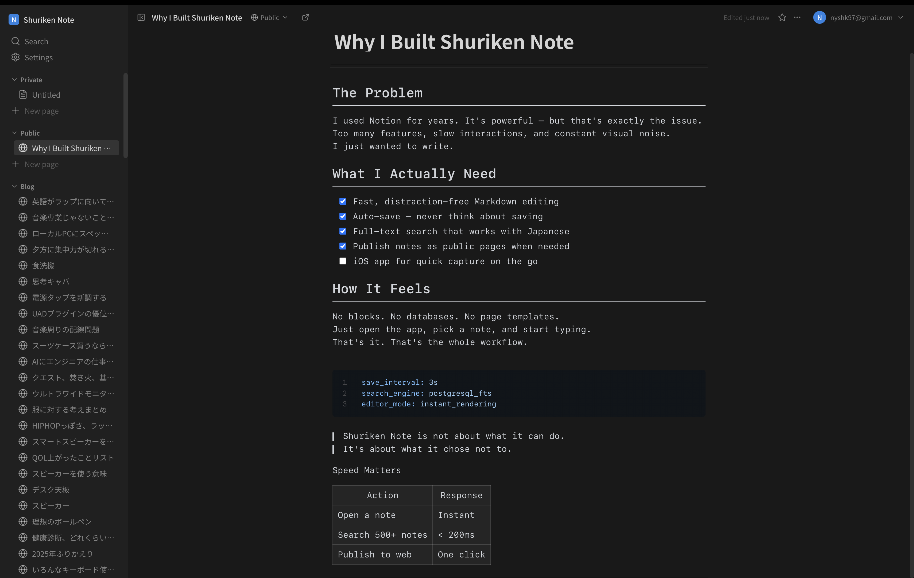
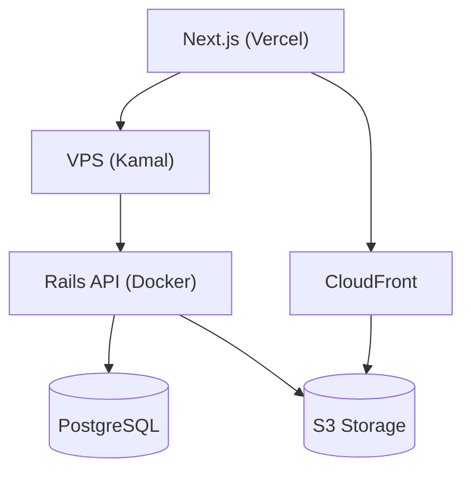

# Shuriken Note

A personal note-taking app built for speed, simplicity, and focus — stripping away unnecessary features from modern note tools.

Used daily and continuously improved. All major technical decisions are documented as [ADRs](#design-decisions-adr).

> **[Product Vision](docs/product/vision.md)** · **[Feature Matrix](docs/product/features.md)** · **[Tech Stack](docs/engineering/tech-stack.md)** · **[Contributing](CONTRIBUTING.md)**



---

## Key Features

- **In-place Markdown editing** — WYSIWYG-style rendering without split preview ([ADR 0010](docs/adr/0010-markdown-editor-selection.md))
- **Auto-save** — changes persist automatically every few seconds, no manual save
- **Full-text search** — powered by PostgreSQL + pg_bigm for Japanese support ([ADR 0002](docs/adr/0002-postgres-fts.md))
- **Public note publishing** — share individual notes as read-only public pages
- **Note lifecycle management** — private / public / archived states with clear transitions ([ADR 0012](docs/adr/0012-note-visibility-and-lifecycle.md))
- **Image upload** — drag-and-drop via Active Storage Direct Upload to S3 ([ADR 0003](docs/adr/0003-active-storage-direct-upload.md))
- **OpenAPI documentation** — API specs auto-generated from RSpec via rswag ([ADR 0001](docs/adr/0001-rest-openapi.md))

---

## Architecture


```mermaid
flowchart TD
  Web["Next.js (Vercel)"]
  VPS["VPS (Kamal)"]
  API["Rails API (Docker)"]
  DB[("PostgreSQL")]
  CF["CloudFront"]
  S3[("S3 Storage")]

  Web --> VPS --> API --> DB
  API --> S3
  Web --> CF --> S3
```

| Layer        | Technology                                   |
| ------------ | -------------------------------------------- |
| Frontend     | Next.js 15 · TypeScript · Tailwind CSS · shadcn/ui |
| Backend      | Ruby on Rails 8 (API mode) · RSpec · rswag   |
| Database     | PostgreSQL 17 + pg_bigm                      |
| File Storage | AWS S3 (Active Storage Direct Upload)        |
| CDN / TLS    | kamal-proxy (Let's Encrypt) · CloudFront     |
| Deploy       | Kamal                                        |
| Observability| Sentry · CloudWatch Logs                     |

Initially deployed on AWS ECS Fargate + RDS, later [migrated to VPS](docs/adr/0013-vps-migration-hybrid-deployment.md) for cost optimization while keeping S3 for file storage. See [ADR 0006](docs/adr/0006-infrastructure-deployment.md) for the original infrastructure design.

---

## Repository Structure

Monorepo layout:

```
apps/
  api/     # Rails API (Ruby)
  web/     # Next.js frontend (TypeScript)
  ios/     # iOS app (SwiftUI) — planned
```

---

## Getting Started

### Prerequisites

- Docker & Docker Compose
- [mise](https://mise.jdx.dev/) (task runner & version manager)

### Setup

```bash
git clone https://github.com/nyshk97/shuriken-note.git
cd shuriken-note

cp apps/web/.env.example apps/web/.env.local
docker compose up -d
mise run setup
```

### Start

```bash
mise run up
# API: http://localhost:3000
# Web: http://localhost:3001
```

### Credentials

This project uses Rails encrypted credentials ([ADR 0008](docs/adr/0008-secret-management.md)).

**For forked repositories**, create your own credentials:

```bash
rm apps/api/config/credentials.yml.enc
docker compose exec api bin/rails credentials:edit
```

```yaml
jwt:
  secret_key: "your-random-secret-key-here"

admin:
  email: "your@email.com"
  password: "your-secure-password"
```

Then seed the admin user:

```bash
docker compose exec api bin/rails db:seed
```

---

## Design Decisions (ADR)

| # | Decision | Status |
|---|----------|--------|
| [0001](docs/adr/0001-rest-openapi.md) | REST + OpenAPI | Accepted |
| [0002](docs/adr/0002-postgres-fts.md) | PostgreSQL Full Text Search | Accepted |
| [0003](docs/adr/0003-active-storage-direct-upload.md) | Active Storage Direct Upload | Accepted |
| [0004](docs/adr/0004-authentication-strategy.md) | Authentication Strategy (JWT) | Accepted |
| [0005](docs/adr/0005-authorization-strategy.md) | Authorization Strategy | Accepted |
| [0006](docs/adr/0006-infrastructure-deployment.md) | Infrastructure and Deployment | Accepted |
| [0007](docs/adr/0007-error-handling-strategy.md) | Error Handling Strategy | Accepted |
| [0008](docs/adr/0008-secret-management.md) | Secret Management | Accepted |
| [0009](docs/adr/0009-web-token-storage.md) | Web Token Storage | Accepted |
| [0010](docs/adr/0010-markdown-editor-selection.md) | Markdown Editor Selection | Accepted |
| [0011](docs/adr/0011-no-slug-for-notes.md) | No Slug for Notes | Accepted |
| [0012](docs/adr/0012-note-visibility-and-lifecycle.md) | Note Visibility and Lifecycle | Accepted |
| [0013](docs/adr/0013-vps-migration-hybrid-deployment.md) | VPS Migration and Hybrid Deployment | Accepted |

---

## License

MIT
